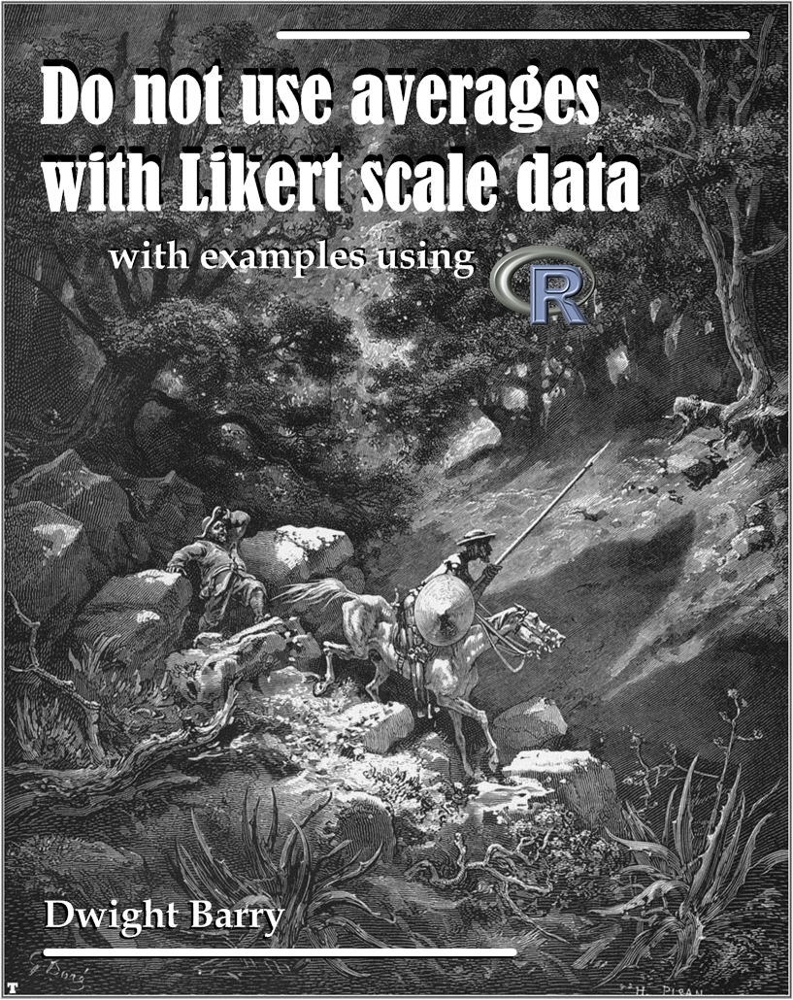

--- 
title: "Do not use averages with Likert scale data"
author: "Dwight Barry"
date: "`r Sys.Date()`"
site: bookdown::bookdown_site
output: bookdown::gitbook
documentclass: book
github-repo: Rmadillo/likert
cover-image: images/likert_cover.jpg
url: 'https\://bookdown.org/Rmadillo/likert/'
description: "This is a short overview of why averages don't work well for evaluating Likert scale or other ordinal-scale data, and what to do instead, with examples using R."
---

# About {-}

```{r cover, fig.align='center', echo=FALSE}

```

This is a short overview of why averages don't work well for evaluating Likert scale or other ordinal-scale data, and what to do instead, with examples using R. While the examples are focused on healthcare surveys, the lessons apply to any use of ordinal scale data.  

Note: all of the data in this document is fake, created specifically to illustrate particular points. 

*Contact/Twitter:* @healthstatsdude   

*PDF version:*   

*Website:* https://bookdown.org/Rmadillo/likert/  

*Corrections/Pull requests:* https://github.com/Rmadillo/likert   

*Cover image*: Gustave Doré, 1863. Illustration 12 for Cervantes's *Don Quixote*. [Public Domain]( https://commons.wikimedia.org/w/index.php?curid=677913).  


```{r ccbysa, echo=FALSE}
knitr::include_graphics('/Users/dbarr1/Documents/R/bookdown/likert/images/cc-by-sa.png')
```

*This work is licensed under a [Creative Commons Attribution-ShareAlike 4.0 License](https://creativecommons.org/licenses/by-sa/4.0/).*  

```{r setup_hidden, include=FALSE}
knitr::opts_chunk$set(warning = FALSE, message = FALSE, comment = "> ", fig.height = 3, fig.align = "center")
```

## R packgaes {-}

```{r setup}
#### Packages ####
library(grid)
library(nnet)
library(coin)
library(boot)
library(simpleboot)
library(knitr)
library(ggplot2)
library(dplyr)
library(AICcmodavg)
library(polycor)
library(likert)
library(MASS)
library(ordinal)
```

## Data {-}

```{r datsets}
#### Basic example data set ####
person = c('A','B','C','D','E','F')

# Original 
year1 = c(5,4,4,4,4,4)
year2 = c(2,5,5,5,5,4)
year3 = c(3,5,5,5,5,3)
year4 = c(1,5,5,5,5,5)

# A more obvious version
# year1 = c(3,3,3,3,3,3)
# year2 = c(4,4,4,2,2,2)
# year3 = c(5,4,3,3,2,1)
# year4 = c(5,5,5,1,1,1)
 
ex_1 = data.frame(person, year1, year2, year3, year4)
 
ex_1_long = reshape2::melt(ex_1)

#### Larger example data set ####

set.seed(29)

md = data.frame(Group = as.character("MD"), 
    Response1 = ordered(sample(1:5, 100, replace=T, prob=c(.1,.1,.1,.2,.5))), 
    Response2 = ordered(sample(1:5, 100, replace=T, prob=c(.1,.3,.3,.25,.15))))
rn = data.frame(Group = as.character("RN"), 
    Response1 = ordered(sample(1:5, 100, replace=T, prob=c(.1,.1,.5,.2,.1))), 
    Response2 = ordered(sample(1:5, 100, replace=T, prob=c(.1,.15,.45,.15,.15))))
 
both = rbind(md, rn)

# Add some NAs 
make_NAs = sample(1:200, 15, replace=F)
both$Response1[make_NAs] = NA
 
make_NAs2 = sample(1:200, 15, replace=F)
both$Response2[make_NAs2] = NA

# Add question names to data
names(both) = c("EmployeeType", 
                "My team works well together.", 
                "I have the tools I need to do my job.")

#### Dashboarding pain scores example ####

# Create list for random pain scores
pain_list = list()

for(i in 1:24){
  set.seed(i)
  pain_level = ordered(sample(c("Low", "Medium", "High"), size = sample(10:30),
    replace = T, prob = c(.15, .45, .40)), levels = c("Low", "Medium", "High"))
  pain_list[[i]] = table(pain_level)
}

# Unlist into a data frame
pain_df = data.frame(matrix(unlist(pain_list), nrow=24, byrow=T))
colnames(pain_df) = c("Low", "Medium", "High")

# Add some months
pain_scores = data.frame(Month = seq(as.Date("2014-10-01"), by = "month", 
  length.out = 24), pain_df)

# Melt into long form, I really should learn tidyr
pain_scores = reshape2::melt(pain_scores, id.vars = "Month", 
  variable.name = "Pain_Group", value.name = "Count")

# Summarize to get counts and percentages
surgeries_pain = pain_scores %>% 
  group_by(Month) %>%
  mutate(Surgeries = sum(Count), percent = (Count / sum(Count)), 
    cumsum = cumsum(percent))

#### For use with chi-square and regression models ####

# Get rid of NAs
both2 = na.omit(both)

# Rename columns to something more R-friendly
names(both2) = c("EmployeeType", "Teamwork", "Tools")

# Reverse the levels so 5 will be at top of mosaic plot
both2$Teamwork = ordered(both2$Teamwork, levels = c("5", "4", "3", "2", "1"))

# Make a table object
both2_tab = xtabs(~ both2$EmployeeType + both2$Teamwork)

# For multinomial and prop odds models
both3 = both2

# Bring axis back to normal
both3$Teamwork = ordered(both3$Teamwork, levels = c("1", "2", "3", "4", "5"))

# Data frame for proportional odds regression
Teamwork_tab_long = both3[,1:2] %>%
  group_by(EmployeeType, Teamwork) %>%
  summarize(Count = n())

# Function to turn counts into rows I found laying around the web somewhere
countsToCases = function(x, countcol = "Count") {
    # Get the row indices to pull from x
    idx = rep.int(seq_len(nrow(x)), x[[countcol]])
    # Drop count column
    x[[countcol]] = NULL
    # Get the rows from x
    x[idx, ]
}

# Make a data frame for prop odds
Teamwork_tab_long$Teamwork_Group = as.numeric(Teamwork_tab_long$Teamwork) 
Teamwork_tab_long$Teamwork = ordered(Teamwork_tab_long$Teamwork) 
tab_df = data.frame(countsToCases(Teamwork_tab_long, countcol="Count"))
```
